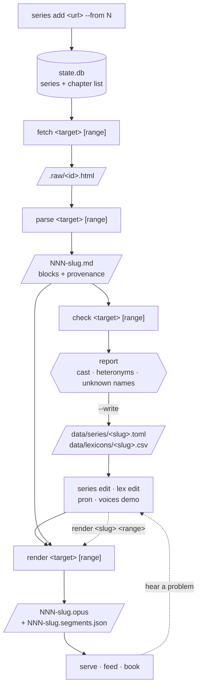

# webnovel-audio

Turn web-serial fiction (Royal Road) into good multi-voice audiobooks, and keep a
clean text archive of every chapter while you're at it. Offline, batch, CPU-only —
no GPU, no cloud, no account required.

- **Multi-voice narration** — narrator + a distinct internal-monologue voice +
  per-character dialogue casting + a "system" voice for LitRPG status boxes + a
  band-limited voice pool for livestream "chat" overlays, each with its own
  post-processing chain.
- **Rule-based dialogue attribution** — explicit tags, pronoun + gender, sticky
  continuations, descriptive referents ("the old woman"). No model download; every
  decision is visible and overridable in config.
- **Library** — track a series, `sync` renders every new chapter past where you
  left off; drive it from a **Tcl/Tk control UI** or a systemd timer.
- **Provider seam** — Royal Road + local files today; a new source (webnovel.com,
  usenet/mbox, …) is one class producing the shared `Document`.
- **Three outputs per chapter** — mastered Opus, a **readable Markdown** copy
  (decoys stripped, structure kept, YAML provenance — feeds `pandoc … -o epub`),
  and the internal narration script.
- **Delivery** — a localhost/LAN server with a per-series **podcast RSS feed**
  (real dates, durations, cover art, HTTP Range), or a chapterised **`.m4b`**.
- **Faithful text handling** — anti-piracy decoy paragraphs removed, LitRPG
  number/stat normalization, a global respelling lexicon (`Montgomery`, `Eleanor`,
  … — names the TTS g2p gets wrong) with per-series lexicons layered on top.

Built for and tuned on an AMD Ryzen 7 8745HS / Radeon 780M laptop (no CUDA).
Rendering is not realtime — a ~2,800-word chapter is ~17 min of audio in ~3–5 min
wall. Architecture and design notes: [`docs/DESIGN.md`](docs/DESIGN.md).
Setup, deployment, automation, troubleshooting: [`SETUP.md`](SETUP.md).

## Requirements

- Linux, Python **3.12** (pinned; [`uv`](https://docs.astral.sh/uv/) fetches it)
- `ffmpeg` on `PATH`
- optional: `qrencode` (`serve` prints a scannable QR), `pandoc` (Markdown → EPUB)

## Quick start

```sh
git clone <this-repo> ~/Projects/webnovel-audio && cd ~/Projects/webnovel-audio
uv sync --extra kokoro                 # venv + deps + the Kokoro TTS engine
uv run webnovel-audio models fetch     # ~400 MB, once
cp config.example.toml config.toml

# 1. track it (metadata only — no chapter downloads)
uv run webnovel-audio series add <royal-road-fiction-url> --from start

# 2. pull + parse the first 10 (cheap: ~25 s, almost all politeness delay)
uv run webnovel-audio fetch <slug> 1-10
uv run webnovel-audio parse <slug> 1-10

# 3. see what needs configuring, and write the starter config
uv run webnovel-audio check <slug> 2-10 --write
uv run webnovel-audio series edit <slug>       # adjust the cast by ear
uv run webnovel-audio lex edit <slug>          # fix pronunciations

# 4. render (the only expensive step, ~3–5 min/chapter)
uv run webnovel-audio render <slug> 1-10

# 5. listen
uv run webnovel-audio serve                    # http://<this-machine>:8080/
```

Then the steady state is one command — `webnovel-audio sync` pulls, parses and
renders everything new across every enabled series (`schedule --install` runs it
nightly). When a new character shows up 40 chapters later, drop back to step 3
with `check <slug> 50-55 --write`; it only ever *adds* cast entries, never
rewrites the ones you've tuned.

## The pipeline

Each stage is separately runnable, idempotent, and resumable. Everything before
`render` is effectively free, which is the point: get the configuration right
while iteration costs milliseconds, not minutes.



| stage | cost per chapter | network | writes |
|---|---|---|---|
| `series add` | one page | yes | DB rows |
| `fetch` | ~2.5 s (politeness delay, not work) | **yes** | `.raw/<id>.html` |
| `parse` | ~30 ms | no | `NNN-slug.md` |
| `check` | ~50 ms | no | report; `--write` → config + lexicon |
| `render` | **~40 s per 3.6 min of audio** (88% TTS, 12% loudness) | no | `NNN-slug.opus` |

`sync` is just `series refresh` + `render` with an implicit range, over every
enabled series — the daily driver, not a special code path.

## Calling convention

Every pipeline verb takes the same two positional arguments:

```
webnovel-audio <verb> <target> [range]
```

**`<target>`** is a tracked series (slug, id, or title substring) *or* a path /
URL for a one-off — the same way `git show` accepts a ref or a path.

**`[range]`** is `N`, `N-M`, `N-`, or `-M`, and its presence changes the mood:

| | with a range | without |
|---|---|---|
| `render <s> 20-30` | **imperative** — render those, whatever their recorded state | **declarative** — render whatever is outstanding |
| `fetch <s> 20-30` | re-fetch those | fetch what's missing |
| `parse <s> 20-30` | re-parse those | parse what's unparsed |

So re-rendering after a config change is just `render <slug> 20-30` — there's no
separate "mark these dirty" step, and no `--force`. Stages also pull their own
inputs: `render <slug> 20-30` on chapters you never fetched will fetch and parse
them first.

## Commands

**Pipeline** — all take `<target> [range]`:

| command | what |
|---|---|
| `fetch <target> [range]` | download chapter source into the raw cache |
| `parse <target> [range]` | raw → blocks → readable `.md`. `--explain` dumps the parse |
| `check <target> [range]` | cast / heteronyms / unknown names report. `--write` applies it |
| `render <target> [range]` | → mastered `.opus`. `-o` for a one-off file, `--dry-run` for segments only |
| `sync [series] [--limit N]` | refresh + render everything outstanding, all enabled series |

**Series** (porcelain):

| command | what |
|---|---|
| `series add <url> [--from N]` | start tracking — metadata only, no chapter downloads |
| `series list` | dashboard: per-stage counts, what's next, errors |
| `series show <slug>` | one series in detail |
| `series set <slug> <pos>` | mark everything through `<pos>` as already dealt with |
| `series edit <slug>` | open `data/series/<slug>.toml` in `$EDITOR` |
| `series enable\|disable <slug>` | include / exclude from `sync` (finished a series? disable it) |
| `series refresh [slug]` | re-fetch chapter lists |
| `series forget <slug> [--purge]` | untrack; `--purge` also deletes rendered files |

**State** (plumbing — the chapter state machine, by hand):

| command | what |
|---|---|
| `state show <series> [range]` | per-chapter stage table |
| `state set <series> <range> <status>` | `new` \| `fetched` \| `parsed` \| `rendered` \| `skipped` |
| `state reset <series> [range]` | errors → `new`, to retry them |

**Lexicon / config / voices:**

| command | what |
|---|---|
| `lex edit <slug>` / `lex edit --base` | open the per-series / always-on CSV in `$EDITOR` |
| `lex add <slug> <surface> <respell>` | append a row without opening an editor |
| `lex list [slug]` | show effective entries (base + series, merged) |
| `config show` / `config edit` | resolved paths / open `config.toml` |
| `pron <text> [--series S]` | how the TTS will say it: phonemes + a rough gloss |
| `voices list` / `voices demo` | the 28 ids / a chaptered audition file |

**Delivery + misc:** `serve`, `feed <series>`, `book <series> [range]`,
`models fetch`, `login`, `schedule [--install]`, `ui`.

`--json` is available on `series`, `state`, `check`, `config`, and the pipeline
verbs; `sync`/`fetch`/`render` stream one JSON event per line. Only one
`sync`/`render` runs at a time per state DB (a `flock`), so a second one refuses
with exit 2 rather than fighting for the CPU. Bare `webnovel-audio` prints help
— it never launches the UI implicitly; use `webnovel-audio ui` for that.

### Command-line examples

```sh
# start tracking; --from 40 means "I've already read 40, skip them"
webnovel-audio series add https://www.royalroad.com/fiction/12345/some-fiction --from 40

# what's tracked, where each one is
webnovel-audio series list
webnovel-audio state show some-fiction 1-20      # per-chapter detail

# the cheap stages, ahead of time
webnovel-audio fetch some-fiction 41-50
webnovel-audio parse some-fiction 41-50
webnovel-audio check some-fiction 41-50 --write  # cast + lexicon scaffolding

# tune, then render
webnovel-audio series edit some-fiction          # cast voices
webnovel-audio lex edit some-fiction             # pronunciations
webnovel-audio render some-fiction 41-50

# heard a problem in 44-46? fix, then just render them again
webnovel-audio lex add some-fiction Kaelith kay-lith
webnovel-audio render some-fiction 44-46

# the steady state
webnovel-audio sync                              # everything new, everywhere
webnovel-audio sync some-fiction --limit 3

# one-off file or URL, no tracking involved
webnovel-audio check ./some-chapter.html
webnovel-audio render ./some-chapter.html -o out.opus

# hear how a name will be said before committing to a respelling
webnovel-audio pron Kaelith --series some-fiction
webnovel-audio voices demo -o voices.opus

# delivery
webnovel-audio serve
webnovel-audio book some-fiction 1-40 -o some-fiction.m4b

# done with a series? stop syncing it
webnovel-audio series disable some-fiction

# script against it
webnovel-audio series list --json | jq '.series[] | {slug, pending}'
```

### Control UI

```sh
uv run webnovel-audio ui        # or: wish ui/control.tcl
```

`ui` execs `wish` if it's on `PATH`, otherwise falls back to Python's bundled
Tcl/Tk (`--python` forces that). A Tcl/Tk front end over the CLI: add/track
series, run `sync` on demand or on an in-app schedule (interval or daily),
start/stop the feed **server**, edit the config / base + per-series lexicons,
**Test word…** to preview a pronunciation, with a live log. It's a stand-alone
alternative to the systemd timer — leave it open and it drives the batch runs.
Launched via `wish` directly, set `WEBNOVEL_AUDIO=/path/to/webnovel-audio` if the
CLI isn't found automatically.

The **Selected series** strip opens that series' pronunciation lexicon
(`data/lexicons/<slug>.csv`) or per-series overrides (`data/series/<slug>.toml`)
in your `$EDITOR` via `xdg-open`, sets its narrator voice (written to the
overrides file), and re-queues already-rendered chapters (**Re-render…**) so a
fix takes effect. **Edit config…** and **Base lexicon…** on the toolbar open
`config.toml` and the always-on `data/lexicons/_base.csv`. These open via
`xdg-open`; set `WEBNOVEL_AUDIO_EDITOR` (e.g. `="$EDITOR"`, or `"foot nvim"`) to
force a specific editor — handy because a header-only `.csv` sniffs as
`text/plain` and a filled one as `text/csv`, so `xdg-open` can send them to
different apps.

### Adding a content source

Royal Road and local `.html` are **providers** (`src/webnovel_audio/providers.py`);
plain `.txt` is passed through as-is. A new site (webnovel.com, an mbox, …) is one
`Provider` subclass that produces an `ingest.Document`; everything downstream —
audio, the readable `.md`, the feed, `.m4b` — is provider-agnostic. Contract and
sketches: [`docs/PROVIDERS.md`](docs/PROVIDERS.md).

Per-series overrides: drop `data/series/<slug>.toml` (any `config.toml` section) and `sync` merges it over the base config for that series — see [`data/series/README.md`](data/series/README.md).

## How it works

### Per-chapter outputs

`sync` (and `render` on HTML/URL) writes into `library/<slug>/`:

| file | |
|---|---|
| `NNN-<slug>.opus` | mastered mono Opus, −19 LUFS, tagged |
| `NNN-<slug>.md` | readable story text — decoys removed, structure recovered (`#` / `* * *` / `> ` / `[Handle: …]`), italics → `*…*`, **before** spoken-form rewriting; YAML front-matter with `source`, IDs, fetch time, a SHA-256 of the raw HTML |
| `NNN-<slug>.segments.json` | the internal narration script (voice/style/pause per line) |
| `.raw/<id>.html` | the raw fetched page (provenance; re-fetched if deleted) |

`pandoc library/<slug>/*.md -o book.epub` works today.

### Internal monologue

HTML ingest keeps italic character ranges. A sentence that is ≥
`synth.thought_threshold` (0.6) italic is routed to `voices.thought` and gets the
`[dsp.thought]` chain. Partial-paragraph italics split correctly — "He grimaced.
*Worth a shot.*" → one narration sentence + one thought sentence.

### Casting

`check <target>` runs the attributor and prints `character → Kokoro voice id`
with line counts and a gender guess; paste into `config.toml`, adjust. Speakers
referred to only descriptively ("the old woman") become a lowercase key
(`woman`) you map like any other. `[cast] protagonist` catches untagged
first-person lines; unmapped speakers use `[cast] default`. Attribution is
rules-only and deterministic — it gets tags, pronoun tags, volleys and untagged
continuations right, and mis-assigns the occasional oddly-phrased line, which you
fix in the cast map.

`check <target> [range] --write` does this for a tracked series: it samples the
range, then writes a `data/series/<slug>.toml` with a `[cast.voices]` entry per
detected speaker, each commented with its line count and gender guess — e.g.
`"Mara" = "af_heart"   # 8 line(s), female`. Re-running it on a later range
(`check <slug> 50-55 --write`, once new characters appear) **only appends
speakers it hasn't seen**; lines you've already tuned are never rewritten.

The same pass reports two other things over that text:

- **Heteronyms** — `tear`, `bow`, `wind`, `lead` … flagged with surrounding
  context. These are never auto-corrected: the right reading changes from
  sentence to sentence, so there's no safe blanket fix. Judge by ear, and if one
  matters, a **multi-word lexicon entry** (`a tear in,a tair in`) pins just that
  phrase.
- **Unknown proper nouns** — names in no lexicon yet; `--write` queues them as
  blank rows for you to fill in.

To pick voice ids by ear, `webnovel-audio voices --demo -o voices.opus` renders
one file that says each id then reads a sample paragraph in it (`--only a,b,c`
for a shortlist, `--pause MS` for the gap). It's chaptered one-per-voice — in mpv
jump with PgUp/PgDn (the voice id shows on the OSD), or `mpv --start='#5' …`.

### Livestream chat

`[Handle (Location): message]` lines (a livestream chat watching the protagonist)
become a `chat` style: each handle → a voice from `[chat.voices]` (first distinct
handles get distinct voices so an exchange never collides), the whole layer
band-limited via `[dsp.chat]` and read a bit faster, a soft earcon before each
run, the handle spoken once per chapter. Bracketed lines with **no** `Handle:`
head (`[Scan complete…]`) stay `system` — the in-fiction AI.

### Delivery

`serve` runs a `http.server` (localhost/LAN, read-only): `/` lists tracked series
with a copyable feed URL, `/feed/<slug>.xml` is a live RSS 2.0 + iTunes feed,
`/audio/…` and `/cover/…` serve files with single-range support. Opus-in-Ogg
works in AntennaPod / Podcast Addict / gPodder; Apple Podcasts and Overcast
don't — use `book` for a `.m4b`.

## Configuration

`config.toml` (copy from `config.example.toml`, auto-detected in the working
directory; `-c` for a different one):

`[general]` `base_lexicon` (always-on) + `lexicon` / per-series-config paths · `[voices]` fallback voices · `[cast]` + `[cast.voices]`
per-series casting (`seed_chapters` = `check`'s default sample window) · `[chat]` livestream-chat behaviour · `[synth]`
(`thought_threshold`, `system_rate`) · `[pauses]` · `[audio]` loudness ·
`[dsp.*]` effect chains keyed by speaker / voice / style · `[royalroad]`
(`library_dir`, `state_db`, `request_delay`) · `[serve]` (`host`, `port`) ·
`[book]` bitrate.

## Development

```sh
uv run pytest -q            # ~84 tests, fully offline
uv run python -m compileall -q src/
```

Layout: `providers` (source → `ingest` Document) → `normalize` / `dialogue` /
`segment` (blocks → narration script) → `synth/` (Kokoro or a silent `null`
backend) → `audio` (master + Opus) ; `textout` (Document → Markdown) ; `royalroad`
+ `db` + `sync` (library) ; `feed` + `serve` + `package` (delivery). `cli` wires
it together; `ui/` is a Tcl/Tk front end over the CLI.

## Status & scope

Personal project, still moving. It scrapes Royal Road for **personal listening
only** — respect authors who sell their own audiobooks, and the site's terms.
No warranty.

## License

[0BSD](LICENSE) (BSD Zero Clause) — do anything, no attribution or notice
required. (Swap in the Unlicense or CC0 if you prefer the public-domain framing;
0BSD is the same permissiveness with fewer jurisdictional questions.)
