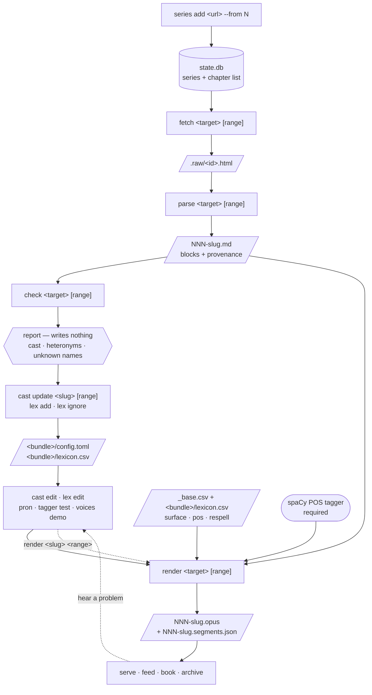
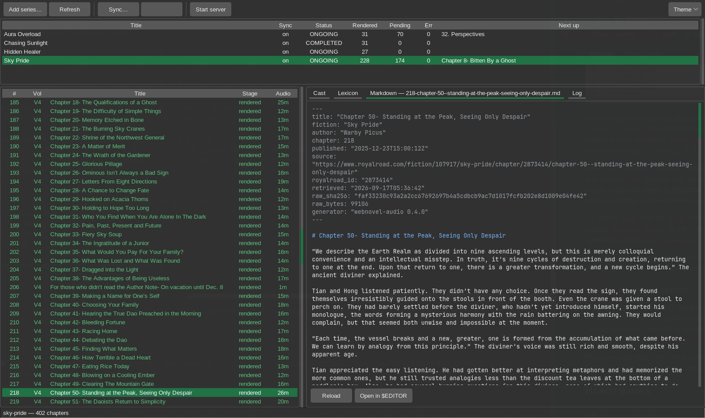

# webnovel-audio

Turn web-serial fiction (Royal Road) into good multi-voice audiobooks, and keep a
clean text archive of every chapter while you're at it. Offline, batch, CPU-only —
no GPU, no cloud, no account required.

- **Multi-voice narration** — narrator + a distinct internal-monologue voice +
  per-character dialogue casting + a "system" voice for LitRPG status boxes + a
  band-limited voice pool for livestream "chat" overlays, each with its own
  post-processing chain.
- **Rule-based dialogue attribution** — explicit tags, pronoun + gender, sticky
  continuations, descriptive referents ("the old woman"). No model download; every
  decision is visible and overridable in config.
- **Library** — track a series, `sync` renders every new chapter past where you
  left off; drive it from the CLI or a **Tcl/Tk control UI**.
- **Provider seam** — Royal Road + local files today; a new source (webnovel.com,
  usenet/mbox, …) is one class producing the shared `Document`.
- **Three outputs per chapter** — mastered Opus, a **readable Markdown** copy
  (decoys stripped, structure kept, YAML provenance — feeds `pandoc … -o epub`),
  and the internal narration script.
- **Delivery** — a localhost/LAN server with a per-series **podcast RSS feed**
  (real dates, durations, cover art, HTTP Range), or a chapterised **`.m4b`**.
- **Faithful text handling** — anti-piracy decoy paragraphs removed, LitRPG
  number/stat normalization, and one pronunciation table that covers both names
  the g2p mangles (`Montgomery`, `Eleanor`) and heteronyms the grammar decides
  (`live`/VERB vs `live`/ADJ), with per-series rules layered on top.

Built for and tuned on an AMD Ryzen 7 8745HS / Radeon 780M laptop (no CUDA).
Rendering is not realtime — a ~2,800-word chapter is ~17 min of audio in ~3–5 min
wall. Architecture and design notes: [`docs/DESIGN.md`](docs/DESIGN.md).
Setup, deployment, automation, troubleshooting: [`SETUP.md`](SETUP.md).

## Requirements

- Linux, Python **3.12+** — [`uv`](https://docs.astral.sh/uv/) prefers your
  distribution's (`tk` must be installed alongside it, for the control UI)
- `ffmpeg` on `PATH`
- optional: `qrencode` (`serve` prints a scannable QR), `pandoc` (Markdown → EPUB)

## Quick start

```sh
git clone <this-repo> ~/Projects/webnovel-audio && cd ~/Projects/webnovel-audio
uv sync --extra kokoro                 # venv + deps + Kokoro TTS + the POS tagger
uv run webnovel-audio models fetch     # ~400 MB, once
cp config.example.toml config.toml

# 1. track it (metadata only — no chapter downloads)
uv run webnovel-audio series add <royal-road-fiction-url> --from start

# 2. pull + parse the first 10 (cheap: ~25 s, almost all politeness delay)
uv run webnovel-audio fetch <slug> 1-10
uv run webnovel-audio parse <slug> 1-10

# 3. see what needs configuring, then apply what you want
uv run webnovel-audio check <slug> 2-10        # report only, writes nothing
uv run webnovel-audio cast update <slug> 2-10  # add the speakers it found
uv run webnovel-audio cast edit <slug>         # adjust voices by ear
uv run webnovel-audio lex edit <slug>          # fix pronunciations

# 4. render (the only expensive step, ~3–5 min/chapter)
uv run webnovel-audio render <slug> 1-10

# 5. listen
uv run webnovel-audio serve                    # http://<this-machine>:8080/
```

Then the steady state is one command — `webnovel-audio sync` pulls, parses and
renders everything new across every enabled series, after showing you how much
CPU that will cost. When a new character shows up 40 chapters later, drop back to step 3
with `cast update <slug> 50-55`; it only ever *adds* speakers, never rewrites
the ones you've tuned.

## The pipeline

Each stage is separately runnable, idempotent, and resumable. Everything before
`render` is effectively free, which is the point: get the configuration right
while iteration costs milliseconds, not minutes.



| stage | cost per chapter | network | writes |
|---|---|---|---|
| `series add` | one page | yes | DB rows |
| `fetch` | ~2.5 s (politeness delay, not work) | **yes** | `.raw/<id>.html` |
| `parse` | ~30 ms | no | `chapters/NNN-slug.md` |
| `check` | ~50 ms | no | nothing — report only (`cast update` / `lex add` apply) |
| `render` | **~40 s per 3.6 min of audio** (88% TTS, 12% loudness) | no | `chapters/NNN-slug.opus` |

`sync` is just `series refresh` + `render` with an implicit range, over every
enabled series — the daily driver, not a special code path.

## Calling convention

Every pipeline verb takes the same two positional arguments:

```
webnovel-audio <verb> <target> [range]
```

**`<target>`** is a tracked series (slug, id, or title substring) *or* a path /
URL for a one-off — the same way `git show` accepts a ref or a path.

**`[range]`** is `N`, `N-M`, `N-`, or `-M`, and its presence changes the mood:

| | with a range | without |
|---|---|---|
| `render <s> 20-30` | **imperative** — render those, whatever their recorded state | **declarative** — render whatever is outstanding |
| `fetch <s> 20-30` | re-fetch those | fetch what's missing |
| `parse <s> 20-30` | re-parse those | parse what's unparsed |

So re-rendering after a config change is just `render <slug> 20-30` — there's no
separate "mark these dirty" step, and no `--force`. Stages also pull their own
inputs: `render <slug> 20-30` on chapters you never fetched will fetch and parse
them first.

## Commands

**Pipeline** — all take `<target> [range]`:

| command | what |
|---|---|
| `fetch <target> [range]` | download chapter source into the raw cache |
| `parse <target> [range]` | raw → blocks → readable `.md`. `--explain` dumps the parse |
| `check <target> [range]` | cast / heteronyms / unknown names report. **Never writes** |
| `render <target> [range]` | → mastered `.opus`. `-o` for a one-off file, `--dry-run` for segments only. Reports how many segments came from cache |
| `sync [series] [--limit N]` | refresh + render everything outstanding; shows a size estimate and confirms first (`-y` to skip) |
| `tagger status` \| `install` \| `test` | the spaCy POS tagger the rules resolve against. **Required to render**, so `--extra kokoro` installs it and the small model; `install --model en_core_web_md` upgrades |
| `progress [series] [--watch]` | what a running sync is doing, from the live state DB. **Read-only**, safe mid-render |

**Series** (porcelain):

| command | what |
|---|---|
| `series add <url> [--from N]` | start tracking — metadata only; `--from` marks 1..N `skipped` |
| `series list` | dashboard: per-stage counts, what's next, errors |
| `series show <slug>` | one series in detail |
| `series enable\|disable <slug>` | include / exclude from `sync` — the UI calls this Pause/Resume |
| `series refresh [slug]` | re-fetch chapter lists **and series metadata** (tags, rating, status) |
| `series forget <slug> [--purge]` | untrack; `--purge` deletes the whole bundle — audio, text, raw and cache |
| `series path <slug>` | print the bundle directory, bare — `cd "$(… series path x)"` |
| `series archive <slug> [-o F]` | tar the bundle; `--with-cache` to include `.cache/` |
| `series import <path>` \| `series scan [root]` | adopt a bundle / re-locate moved ones |
| `series export [slug]` | rewrite `manifest.toml` + `state.json` now |
| `series migrate [slug]` | move a pre-bundle series into the layout |
| `series reclaim` | drop shared-cache links now duplicated inside bundles |

**Cache** — the synthesized-segment store (see [Segment cache](#segment-cache)):

| command | what |
|---|---|
| `cache status [slug]` | size, generations, per-series totals, what's reclaimable |
| `cache compact [slug]` | re-encode float32 wav → FLAC under the current generation |
| `cache prune [slug]` | delete unreachable entries; `--stale` drops old generations |
| `cache clear [slug]` | delete everything, reachable or not — quotes the CPU cost first |

`prune` and `clear` need explicit consent: `-y`, or "yes" at a terminal.
`--json` does **not** imply it. `-n` previews.

**State** (plumbing — the chapter state machine, by hand):

| command | what |
|---|---|
| `state show <series> [range]` | per-chapter stage table |
| `state set <series> <range> <status>` | `new` \| `fetched` \| `parsed` \| `rendered` \| `skipped` |
| `state reset <series> [range]` | errors → `new`, to retry them |

**Lexicon / config / voices:**

| command | what |
|---|---|
| `cast edit <slug>` | open the series config (voices) in `$EDITOR` |
| `cast update <slug> [range]` | merge in speakers found in that range (`--diff` to preview) |
| `cast set <slug> <speaker> <voice>` | assign one voice without an editor (`""` = unassigned) |
| `cast show <slug>` | the effective cast, including unassigned speakers |
| `lex edit <slug>` / `lex edit --base` | open the per-series / always-on CSV in `$EDITOR` |
| `lex ignore <slug> <word>…` | mark words "reads fine", so `check` stops listing them |
| `lex add <slug> <surface> <respell>` | append a row without opening an editor |
| `lex list [slug]` | show effective entries (base + series, merged) |
| `config show` / `config edit` | resolved paths / open `config.toml` |
| `pron <text> [--series S]` | how the TTS will say it: phonemes + a rough gloss |
| `voices list` / `voices demo` | the 28 ids / a chaptered audition file |

**Delivery + misc:** `serve`, `feed <series>`, `book <series> [range]`,
`retag [series]` (refresh Opus tags with no re-encode), `schema` (the command
surface as JSON), `models fetch|path`, `login`, `ui`.

### Driving it from a script or an agent

`schema --json` emits every command, argument and choice, walked out of argparse
so it can't drift from the real parser — enough to plan against without reading
`--help`. Failures under `--json` are structured rather than prose:

```json
{"ok": false, "error": {"code": "no_such_series",
                        "message": "no tracked series matching 'skypride'",
                        "hint": "webnovel-audio series list"}}
```

so a caller branches on `code` instead of matching English. Exit codes are `0`
ok, `1` failed, `2` another render/sync holds the lock. Everything that changes
state has a non-interactive form — `cast set`, `lex add`, `lex ignore`,
`state set`, `series enable|disable` — and `sync --estimate --json` reports the
cost before committing to it.

### Volumes

Royal Road serials often restart chapter numbering per volume, each with its own
cover — Sky Pride has six. `window.volumes` gives an authoritative mapping and
every chapter carries its `volumeId`, so this is modelled as an **attribute of
the chapter**, not as separate series: one cast, one lexicon, one config, with
volume driving display and delivery.

- the chapter pane gains a **Vol** column (hidden for series without volumes)
- the feed emits `<itunes:season>` per volume and a volume-relative
  `<itunes:episode>`, so a chapter reads as "Volume 2, episode 16" instead of
  "chapter 69"
- each volume's cover is cached alongside the series cover
- Opus tags carry `VOLUME`, `VOLUME_INDEX`, a volume-relative `TRACKNUMBER`,
  and an `album` of `<series> — <volume>`

Two things the data forces: **a chapter in no volume is normal** (authors assign
them per chapter — Spector leaves 529 of 746 unassigned), and the position
within a volume is *not* the author's chapter number, because an interstitial
shifts it. Show notes therefore name the volume but never assert a chapter
number that would contradict the title.

`--json` is available on `series`, `state`, `check`, `config`, and the pipeline
verbs; `sync`/`fetch`/`render` stream one JSON event per line. Only one
`sync`/`render` runs at a time per state DB (a `flock`), so a second one refuses
with exit 2 rather than fighting for the CPU. Bare `webnovel-audio` prints help
— it never launches the UI implicitly; use `webnovel-audio ui` for that.

### Command-line examples

```sh
# start tracking; --from 40 means "I've already read 40, skip them"
webnovel-audio series add https://www.royalroad.com/fiction/12345/some-fiction --from 40

# what's tracked, where each one is
webnovel-audio series list
webnovel-audio state show some-fiction 1-20      # per-chapter detail

# the cheap stages, ahead of time
webnovel-audio fetch some-fiction 41-50
webnovel-audio parse some-fiction 41-50
webnovel-audio check some-fiction 41-50           # report: what needs deciding
webnovel-audio cast update some-fiction 41-50    # add the speakers it found

# tune, then render
webnovel-audio cast edit some-fiction            # adjust voices by ear
webnovel-audio lex edit some-fiction             # pronunciations
webnovel-audio render some-fiction 41-50

# heard a problem in 44-46? fix, then just render them again
webnovel-audio lex add some-fiction Kaelith kay-lith
webnovel-audio render some-fiction 44-46

# the steady state
webnovel-audio sync                              # everything new, everywhere
webnovel-audio sync some-fiction --limit 3

# one-off file or URL, no tracking involved
webnovel-audio check ./some-chapter.html
webnovel-audio render ./some-chapter.html -o out.opus

# hear how a name will be said before committing to a respelling
webnovel-audio pron Kaelith --series some-fiction
webnovel-audio voices demo -o voices.opus

# delivery
webnovel-audio serve
webnovel-audio book some-fiction 1-40 -o some-fiction.m4b

# done with a series? stop syncing it
webnovel-audio series disable some-fiction

# script against it
webnovel-audio series list --json | jq '.series[] | {slug, pending}'
```

### Control UI

```sh
uv run webnovel-audio ui                      # picks a usable interpreter
uv run webnovel-audio ui --interpreter /usr/bin/python3     # or name one
```

A Tcl/Tk front end laid out like **gitk** — series across the top, chapters
bottom-left, a notebook bottom-right (Cast, Lexicon, Markdown, Log):



The UI is hosted by `ui/host.py`, which imports `tkinter` and nothing else —
it talks to the CLI over `--json` for everything it shows. That is why it can
run under a *different* interpreter than the one this package is installed
in, and why it goes looking for one: a Tk compiled without Xft sees a single
font family and draws chapter text in the X11 `fixed` bitmap font, which has
no apostrophes, curly quotes, em dashes or ellipses. Every uv-managed
interpreter has such a Tk, so `ui` prefers its own and quietly reroutes to the
system Python when its own cannot render. It says so when it does.

The theme follows the desktop's light/dark preference, and the toolbar's
**Theme** menu switches it live.

Select chapters (shift/ctrl for ranges and scattered picks) and **right-click**
to **Play** the chapter, run `fetch` / `parse` / `check` / `render` over exactly
that selection, or mark them skipped/new and clear errors. Double-click plays.
Playback uses `$WEBNOVEL_AUDIO_PLAYER` (e.g. `mpv --no-video`) if set, else
`xdg-open`. The selection becomes one comma range —
picking 1, 2, 3, 7, 20, 21 runs `render <slug> 1-3,7,20-21`.

**Sync…** shows a live CPU estimate before it starts. The Cast and Lexicon tabs
edit the bundle's `config.toml` and `lexicon.csv` in place, with an
mtime check so a file that `cast update` changed underneath is never silently
clobbered; **Open in $EDITOR** hands off to `$WEBNOVEL_AUDIO_EDITOR` / `$VISUAL`
/ `$EDITOR` when you want real editing. The feed **server** starts and stops
from the toolbar, and window/sash geometry persists.

The **Markdown** tab shows the selected chapter's `.md` — read-only, wrapped,
and with the filename on the tab. It needs exactly one chapter selected, and
when there is no `.md` yet it says which stage is missing rather than going
blank. All three tabs get shallow syntax highlighting; `$EDITOR` is a button
away and does it properly.

`ui` runs the UI under `ui/host.py` and exports `WEBNOVEL_AUDIO` so it finds
the CLI. `python ui/host.py ui/control.tcl` works directly too — set
`WEBNOVEL_AUDIO=/path/to/webnovel-audio` if it isn't found. `wish
ui/control.tcl` still runs, and is occasionally handy for a Tcl-level problem,
but tkinter is the supported and tested host.

It has no DB or network access of its own: everything goes through the CLI's
`--json` output, so every capability here is one you also have from a terminal.

### Adding a content source

Royal Road and local `.html` are **providers** (`src/webnovel_audio/providers.py`);
plain `.txt` is passed through as-is. A new site (webnovel.com, an mbox, …) is one
`Provider` subclass that produces an `ingest.Document`; everything downstream —
audio, the readable `.md`, the feed, `.m4b` — is provider-agnostic. Contract and
sketches: [`docs/PROVIDERS.md`](docs/PROVIDERS.md).

Per-series overrides live in the bundle: `library/<slug>/config.toml` takes any
`config.toml` section and is merged over the base config for that series.

## How it works

### Where a series lives

Everything about one series is **one directory** — its *bundle*. Move it, tar it,
park it on a slow disk, or `rm -rf` it; nothing else needs updating.

```
library/sky-pride/                  ← the bundle (relocatable)
├── manifest.toml         identity + provenance      machine-written
├── state.json            per-chapter state export   machine-written
├── config.toml           voices, cast, DSP          hand-edited
├── lexicon.csv           pronunciations             hand-edited
├── chapters/
│   ├── 069-….md              readable story text
│   ├── 069-….opus            mastered mono Opus, −19 LUFS, tagged
│   └── 069-….segments.json   the narration script (voice/style/pause per line)
├── covers/
│   ├── cover.jpg
│   └── cover-v10397.jpg      per-volume art, when the fiction has volumes
├── .raw/<id>.html        the fetched page (provenance; re-fetched if deleted)
└── .cache/<backend>/<fingerprint>/<sha1>.flac      synthesized segments
```

The three hand-edited/machine-written files are split by **who writes them**:
`config.toml` and `lexicon.csv` are yours (and `cast set` / `lex add` rewrite
them in place, preserving comments); `manifest.toml` and `state.json` are
rewritten on every sync, so hand edits there are lost.

| file | |
|---|---|
| `chapters/NNN-….md` | readable story text — decoys removed, structure recovered (`#` / `* * *` / `> ` / `[Handle: …]`), italics → `*…*`, **before** spoken-form rewriting; YAML front-matter with `source`, IDs, fetch time, a SHA-256 of the raw HTML |
| `manifest.toml` | uuid, provider + source URL, and hashes of the base lexicon/config it was rendered against |
| `state.json` | every chapter row, paths bundle-relative — this is what makes `series import` exact, including render timings a file scan could never recover |

`pandoc library/<slug>/chapters/*.md -o book.epub` works today.

**Not in the bundle**, deliberately:

| | |
|---|---|
| `~/.local/state/webnovel-audio/state.db` | the operational index across all series. Rebuildable: `series scan` replays every bundle's `state.json` into a fresh one |
| `config.toml` | base config, in the working directory (`-c` for another) |
| `data/lexicons/_base.csv` | always-on rules — names and heteronyms — applied under every series |
| `~/.cache/webnovel-audio/` | the Kokoro model + voice weights (~400 MB, shared) |

### Moving, archiving, deleting

```sh
webnovel-audio series path sky-pride                # where is it?
mv library/sky-pride /mnt/big/ && webnovel-audio series scan /mnt/big
webnovel-audio series archive sky-pride -o sp.tar.zst   # cache excluded
webnovel-audio series forget sky-pride --purge      # bundle and all
```

A bundle that has gone missing is a **supported state**, not an error —
`rm -rf` on a series directory is a legitimate way to reclaim space in a hurry.
`series list` marks it, `series scan` reports it, and nothing infers a deletion
from absence: an unplugged drive must never look like a decision. Restoring is
`tar xf` plus `series scan`.

### Segment cache

Every synthesized segment is cached under
`.cache/<backend>/<fingerprint>/<sha1>.flac`, keyed on
`text|voice|style|rate|pitch|sample_rate` — post-lexicon, so a pronunciation fix
invalidates exactly the lines that changed and nothing else. Re-rendering 38
chapters after one lexicon edit re-synthesized 31 of 7,850 segments and ran
**7.8× faster** than the original pass.

`<fingerprint>` is a short hash of the model bytes, the voice embeddings, the
language, and the g2p chain (espeak-ng / phonemizer / kokoro-onnx versions). It
exists because those change the audio *without* changing the cache key — an
`espeakng-loader` bump can re-phonemize the whole library with no model change
and no visible signal. A bump starts a new generation instead of silently
reusing the old model's audio; `chapters.synth_fingerprint` and the
`SYNTH_MODEL` Opus tag record which generation made each file, and
`cache status` warns when one series spans two.

Segments are FLAC/PCM_16 — about 29% of the float32 they replaced, with a
−96 dBFS error floor far below what the ~48 kbps Opus encode contributes.

### Internal monologue

HTML ingest keeps italic character ranges. A sentence that is ≥
`synth.thought_threshold` (0.6) italic is routed to `voices.thought` and gets the
`[dsp.thought]` chain. Partial-paragraph italics split correctly — "He grimaced.
*Worth a shot.*" → one narration sentence + one thought sentence.

### Casting

`check <target>` runs the attributor and prints `character → Kokoro voice id`
with line counts and a gender guess; paste into `config.toml`, adjust. Speakers
referred to only descriptively ("the old woman") become a lowercase key
(`woman`) you map like any other. `[cast] protagonist` catches untagged
first-person lines; unmapped speakers use `[cast] default`. Attribution is
rules-only and deterministic — it gets tags, pronoun tags, volleys and untagged
continuations right, and mis-assigns the occasional oddly-phrased line, which you
fix in the cast map.

`series add` writes the bundle's `config.toml` immediately, pinning the
**resolved** voices — narrator, thought, dialogue default, system, chat pool.
That's deliberate: global defaults get retuned as you start new series, and
without a pin, re-rendering chapter 12 of an old one would come out in a
different voice than 11 and 13. Same reasoning as a lockfile. (Timing and DSP
are *not* pinned — those are global taste, and a change there is one you want
everywhere.)

`cast update <slug> [range]` then samples the range and appends a
`[cast.voices]` entry per speaker it hasn't seen, commented with line count and
gender — `"Mara" = "af_heart"   # 48 line(s), female`. Run it again on a later
range once new characters appear; it **only ever adds**, never rewrites what
you've tuned. `--diff` shows what it would add.

A speaker whose gender it can't infer — descriptive referents (`girl`, `man`)
and honorifics — is written **unassigned**: `"girl" = ""   # 15 line(s), gender
unclear — pick one`. It stays visible in the file to fix, and falls back to
`[cast] default` until you do. A wrong guess reads like a decision somebody
made; an empty value reads as unfinished.

`check` reports two other things over the same text, and writes nothing:

- **Heteronyms** — `tear`, `bow`, `wind`, `lead` … flagged with surrounding
  context. These are never auto-corrected: the right reading changes from
  sentence to sentence, so there's no safe blanket fix. Judge by ear, and if one
  matters, a **multi-word lexicon entry** (`a tear in,a tair in`) pins just that
  phrase.
- **Unknown proper nouns** — names in no lexicon yet, most frequent first
  (`--top N`). Fix one with `lex add <slug> <word> <respell>`; silence one you've
  checked with `lex ignore <slug> <word>…`, which records it as "reads fine" so
  the list shrinks toward zero. Bulk-dumping candidates into the CSV was worse
  than nothing — a spell-checker's allowlist, not a to-do list.

To pick voice ids by ear, `webnovel-audio voices demo -o voices.opus` renders
one file that says each id then reads a sample paragraph in it (`--only a,b,c`
for a shortlist, `--pause MS` for the gap). It's chaptered one-per-voice — in mpv
jump with PgUp/PgDn (the voice id shows on the OSD), or `mpv --start='#5' …`.

### Livestream chat

`[Handle (Location): message]` lines (a livestream chat watching the protagonist)
become a `chat` style: each handle → a voice from `[chat.voices]` (first distinct
handles get distinct voices so an exchange never collides), the whole layer
band-limited via `[dsp.chat]` and read a bit faster, a soft earcon before each
run, the handle spoken once per chapter. Bracketed lines with **no** `Handle:`
head (`[Scan complete…]`) stay `system` — the in-fiction AI.

### Delivery

`serve` runs a `http.server` (localhost/LAN, read-only): `/` lists tracked series
with a copyable feed URL, `/feed/<slug>.xml` is a live RSS 2.0 + iTunes feed,
`/audio/…` and `/cover/…` serve files with single-range support. Opus-in-Ogg
works in AntennaPod / Podcast Addict / gPodder; Apple Podcasts and Overcast
don't — use `book` for a `.m4b`.

## Configuration

`config.toml` (copy from `config.example.toml`, auto-detected in the working
directory; `-c` for a different one):

`[general]` `base_lexicon` (always-on) + cache/model paths · `[voices]` fallback voices · `[cast]` + `[cast.voices]`
per-series casting (`seed_chapters` = `check`'s default sample window) · `[chat]` livestream-chat behaviour · `[synth]`
(`thought_threshold`, `system_rate`) · `[pauses]` · `[audio]` loudness ·
`[dsp.*]` effect chains keyed by speaker / voice / style · `[royalroad]`
(`library_dir`, `state_db`, `request_delay`) · `[serve]` (`host`, `port`) ·
`[book]` bitrate.

## Development

```sh
uv run pytest -q            # ~230 tests, fully offline
uv run python -m compileall -q src/
```

Regenerating `docs/img/ui.png` (Hyprland): let the window **map at its final
size** and capture it without touching the geometry afterwards. Put the
geometry in `ui.conf` — `control.tcl` applies it late, so a `wm geometry`
set before sourcing is overwritten:

```sh
cp ~/.config/webnovel-audio/ui.conf{,.bak}
printf 'main 1600x950+24+60\ntopheight 150\nbotwidth 690\nlimit 10\ntheme forest-dark\n' \
    > ~/.config/webnovel-audio/ui.conf
python ui/host.py ui/control.tcl &            # WEBNOVEL_AUDIO must be set
sleep 8
ADDR=$(hyprctl clients -j | jq -r '.[]|select(.title=="webnovel-audio")|.address')
hyprctl setprop "address:$ADDR" opaque true   # else the desktop bleeds through
read X Y W H < <(hyprctl clients -j | jq -r --arg a "$ADDR" '.[]|select(.address==$a)|"\(.at[0]) \(.at[1]) \(.size[0]) \(.size[1])"')
grim -g "$X,$Y ${W}x${H}" docs/img/ui.png
mv ~/.config/webnovel-audio/ui.conf{.bak,}
```

Three traps, all of which have bitten:

- Resizing *after* the window maps (floating it, `centerwindow`, …) leaves
  stale framebuffer where Tk doesn't repaint, so other windows bleed through
  the empty parts of a pane. Match on `.title`, not `.class`: tkinter reports
  class `Tk`, and the old `Control.tcl` was wish's.
- Omarchy's default opacity rule makes the dark panes translucent, which
  `grim` captures faithfully. `setprop … opaque true` is the fix; `hyprctl
  keyword` does not work on a non-legacy-parser Hyprland.
- Give the window an offset clear of the top bar, and let the event loop run
  while waiting. A blocking Tcl `after` stops redraws, and `grim` then
  captures a half-painted frame.

To float it at an exact size without a compositor rule, set the X11 window
type before it maps: `wm attributes . -type dialog`.

Layout: `providers` (source → `ingest` Document) → `normalize` / `dialogue` /
`segment` (blocks → narration script) → `synth/` (Kokoro or a silent `null`
backend) → `audio` (master + Opus) ; `textout` (Document → Markdown) ; `royalroad`
+ `db` + `sync` (library) ; `feed` + `serve` + `package` (delivery). `cli` wires
it together; `ui/` is a Tcl/Tk front end over the CLI.

## Status & scope

Personal project, still moving. It scrapes Royal Road for **personal listening
only** — respect authors who sell their own audiobooks, and the site's terms.
No warranty.

## License

[0BSD](LICENSE) (BSD Zero Clause) — do anything, no attribution or notice
required. (Swap in the Unlicense or CC0 if you prefer the public-domain framing;
0BSD is the same permissiveness with fewer jurisdictional questions.)
